# Solid Coffee Shop Application

A web application solid coffee shop, built with React JS and following clean architecture principles.

## Description

This web application was built to handle the online coffee buying and selling business between coffee shops and buyers/users.

## Tech Stack

- **Framework**: React 19, Vite, @vitejs/plugin-react
- **Style**: Tailwind CSS 4, prettier-plugin-tailwindcss
- **State Management**: Redux Toolkit, React Redux, redux-persist
- **Routing**: react-router v7

## Feature

- **Authentication**: Register, Login, Logout
- **User**: Get Product By filter and Detail, Buy product / Create an Order, Create Profile and have Order History
- **Admin**: Sales Dashboard, CRUD for Product, Order, User

## Getting Started

### Dependencies

- [Node.js](https://nodejs.org/) (version 18 or higher)
- npm (Node Package Manager)

### Installing

1. **Clone the Repository:**

   ```bash
   git clone <REPOSITORY_URL>
   cd solid-coffee-shop
   ```

2. **Install Dependencies:**

   ```bash
   npm install
   ```

### Executing program

1. **Run the Development Server:**
   This command will run the application in development mode with hot-reloading.

   ```bash
   npm run dev
   ```

2. Open your browser and navigate to [http://localhost:5173](http://localhost:5173) (or the port displayed in your terminal).

## Documentation

- **Landing Page**
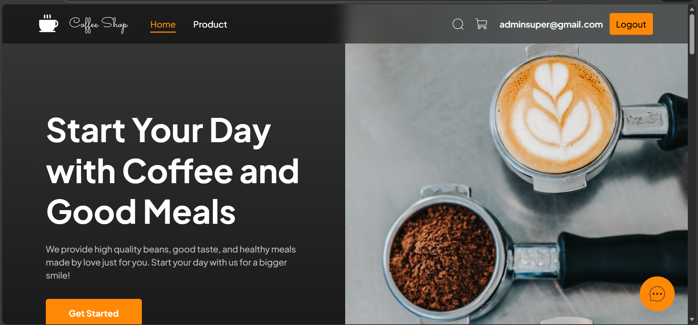

- **Register Page**
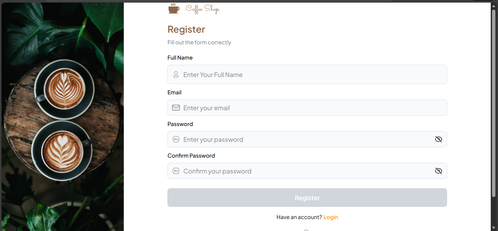

- **Login Page**
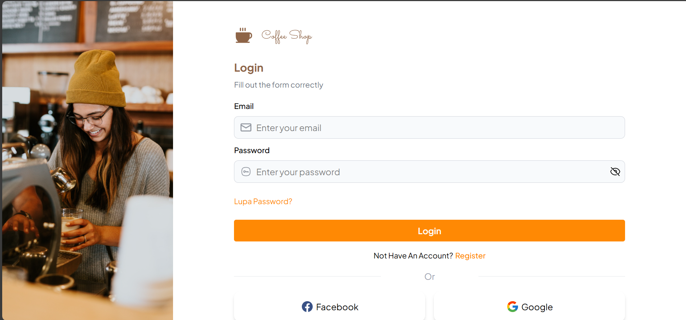

- **Product Page**
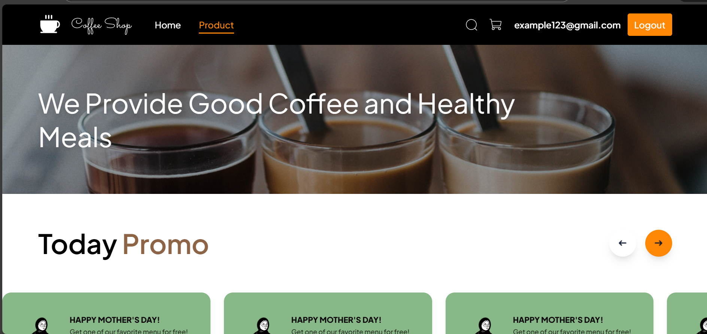
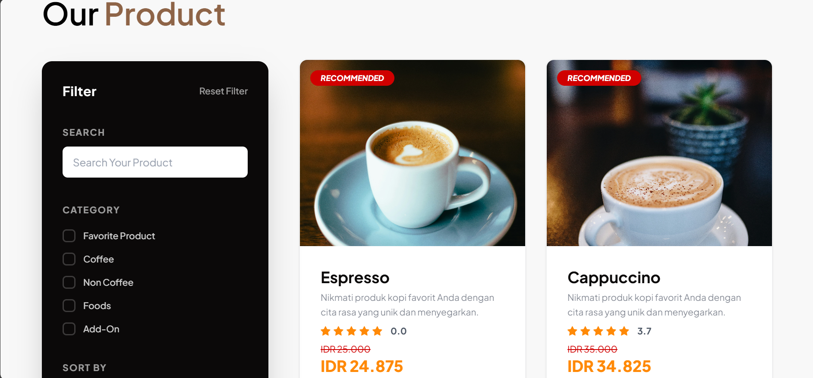

- **Order Page**
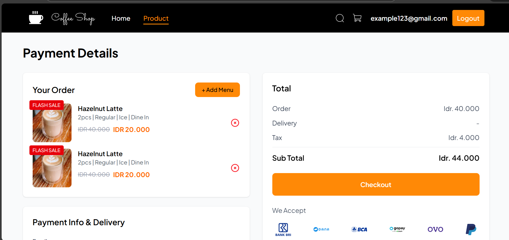

- **Profile Page**
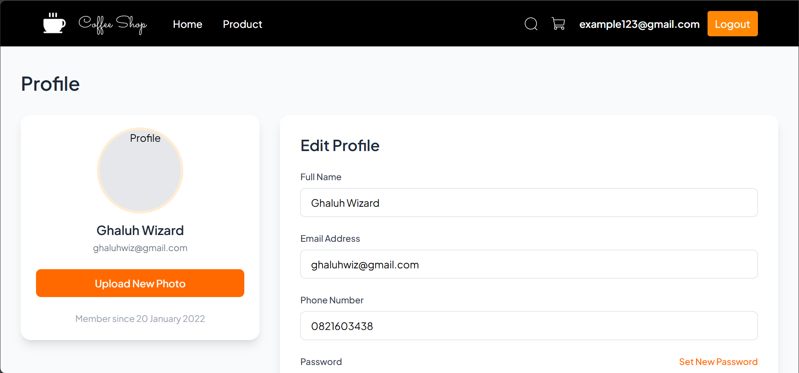

- **Admin Dashboard Page**
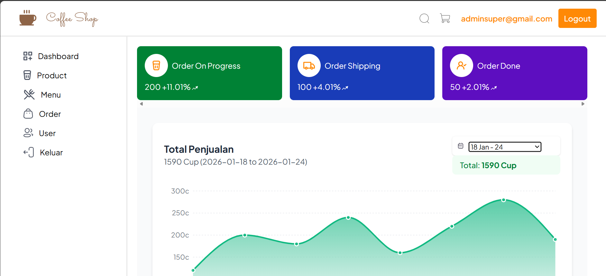

- **Admin Product List Page**
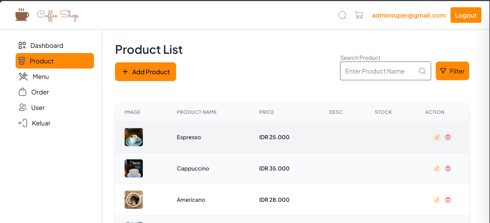

- **Admin Menu List Page**
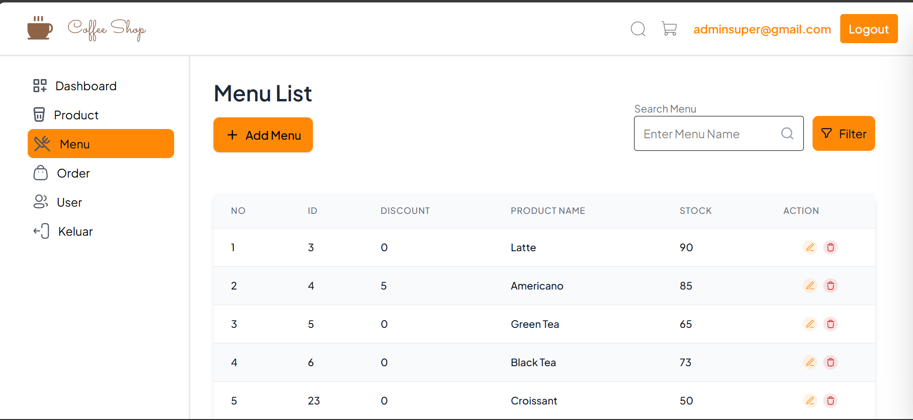

- **Admin Order List Page**
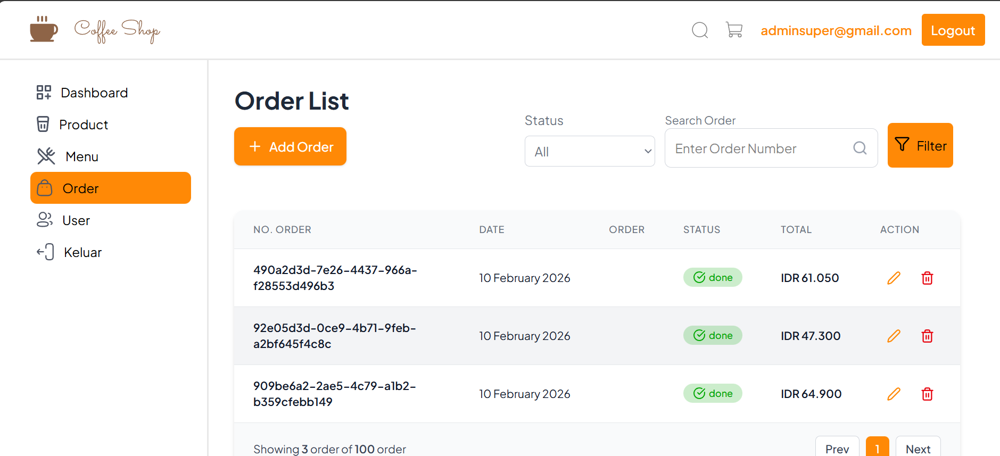

## Help

If you encounter any issues or have questions, please refer to the "Getting Started" section or consider opening an issue on the project's repository.

## Authors

example:

- Nugraha Panca WIbisana - [Github](https://github.com/NugrahaPancaWibisana/)

## Version History

- 0.1.0
  - Initial Release - Basic movie browsing, details, and authentication.

<!-- ## License

This project is licensed under the [NAME HERE] License - see the `LICENSE.md` file for details.
_(e.g., MIT License - see the LICENSE.md file for details)_ -->

## Acknowledgments

- Built with [React](https://reactjs.org/) and [Vite](https://vitejs.dev/)
- Styled using [Tailwind CSS](https://tailwindcss.com/)
- State management powered by [Redux Toolkit](https://redux-toolkit.js.org/)
- Routing handled by [React Router](https://reactrouter.com/)
